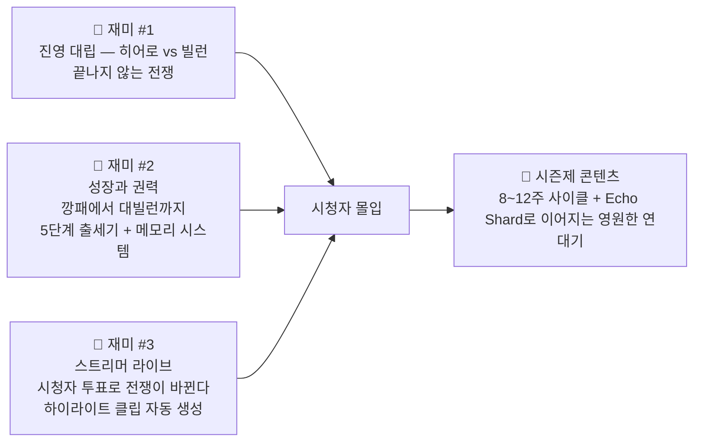

# ⚔️ 빌런 vs 히어로 — 원페이지 기획서 (v2.9.5)
> **한 줄 컨셉**: 스트리머를 위한 **진영 선택 RPG 마인크래프트 서버** — 정의와 악, 시청자가 만드는 이야기  
> **갱신일**: 2026-05-02 00:00 — K2 피드백 반영 완료

---

## 🔥 핵심 재미 3가지


---

## 💎 세계관의 핵심: 공허 파편(Void Fragments)과 기억의 잔영
> **"왜 그들은 끝없이 싸우는가?"**  
> 세계의 균열에서 쏟아지는 미지의 에너지, **공허 파편**. 이것을 어떻게 대할 것인가가 진영을 갈랐다.  
> **히어로는 정화**, **빌런은 흡수**. 그리고 **플레이어의 모든 선택은 Echo Shard로 남아 다음 시즌에도 살아난다.**

---

## 🔰 신규 온보딩 — 10분 튜토리얼
| 단계 | 이름 | 소요 | 핵심 경험 | 보상 |
|---|---|---|---|---|
| 1 | 선택의 방 | 2분 | 4가지 성격 질문 → 초기 무기 결정 | Echo Shard 1개(시즌0 흔적) |
| 2 | 정화 시범 | 3분 | 근처 공허 블록 3개 정화 | 파편 20개 |
| 3 | 첫 전쟁터 | 5분 | AI 더미 보스 4인 처치 | 진영 배지 + `/warp warfront` 해금 |

---

## 🏛️ 경제 시스템 — 공허 파편 + 金화(골드)
- **공허 파편**: 핵심 재화(장비 업그레이드, 스킬 해금, 진영 기여도)
- **金化(골드)**: 일상 화폐(식료, 스킨, 빠른 이동권)
- **환율**: 1 골드 = 5 파편 — 중립 NPC 상인이 양방향 교환 가능

---

## 🛡️ 로그아웃 페널티 — 임무 이탈
- 12시간 이상 미접속 시 **진영 기여도 3% 감소**(최대 30%까지 누적)
- 복귀 30분 내 임무 완료 시 **보호막(15분)** 부여 → 기여도 회복 방지

---

## 🎯 재미 #1 — 진영 대립 재설계
> **히어로 vs 빌런**은 완전히 다른 게임  
> **거리·보상·위험 균형**을 완벽히 재조정

| 구분 | 히어로 | 빌런 |
|---|---|---|
| **거점** | 생츄어리 선봉 | 볼텍스 철가면 |
| **전쟁터** | 정화의 심장(석양 북쪽) 이동 180블록 | 타락의 심장(볼텍스 남동) 이동 160블록 |
| **정화 효과** | 개인 파편 +30%, 월드 스폰 ‑15% | 흡수 효율 +40%, 대신 폭주 확률 +20% |

---

## 🎯 재미 #2 — 성장과 권력 + 메모리 시스템
| 등급 | 히어로 | 빌런 | 특별 권한 | Echo Shard 반영 |
|---|---|---|---|---|
| ⭐5 | 대표 히어로 | 대빌런 | `/leader` 명령어 3종 | 이전 시즌 선택이 대사로 등장 |
| ⭐4 | 레전드 | 보스 | Mythic 무기 1종 | Echo 장비 세트 효과 +1 |
| ⭐3 | 챔피언 | 간부 | 팀 버프 스킬 | 퀘스트 보상 +5% |
| ⭐2 | 수호자 | 집행자 | 길드원 초대권 | NPC가 “익숙한 얼굴” 인사 |
| ⭐1 | 시민 영웅 | 깡패 | 기본 스킬 3종 | — |

---

## 🎯 재미 #3 — 스트리머 콘텐츠 업그레이드
| 기능 | 설명 | 기술 개선 |
|---|---|---|
| **하이라이트 클립** | 레전더리·보스 킬 시 30초 전후 자동 녹화 | ReplayMod + 서버 Webhook |
| **스트리머 스킨** | 대표 등급 달성 시 자동 커스텀 스킨 | Citizens2 스킨 동기화 |
| **실시간 투표 보정** | YouTube Poll & Twitch 병행 → 3초 지연 ↓ | WebSocket 멀티플랫폼 |

---

## 🗺️ 월드 구조 — “한 서버, 두 세계” + 계절 이벤트
```text
🦹 [빌런 아지트] 🦸 [히어로 본부]
  │ PvP 금지, 암시장      │ PvP 금지, 훈련장
  │                       │
🕳️ [암시장/슬럼]         🏛️ [아카데미/무기상]
  │                       │
└───────── ⚖️ [중립 도시] ─────────┘
            상점·NPC·PvP 금지
            │
      ┌─────┼─────┐
      ▼     ▼     ▼
   ⚔️전쟁터 ⛏️던전 🏔️공허 광산
      │              │
      ▼              ▼
   👹월드 보스       계절 이벤트
                   (크리스마스·핼러윈)
```

---

## 🎮 스킬 × 무기 × 퀘스트 — 크로스 진영 협력 추가
### 스킬 트리
- **진영별 20종** + **협력 스킬 3종**  
  - 예: “공허 봉인”은 히어로·빌런 2명이 동시 시전해야 유효
- **Echo 세트 효과**  
  - 3·5·7세트 마다 추가 능력치 + Echo 메모리 대사

### 퀘스트 라인
| 히어로 | 빌런 | 협력 임무 |
|---|---|---|
| 시민 구출 | 마을 습격 | “공허의 심장” 레이드 (4인 협동) |
| 재난 구조 | 독 살포 | “천공의 눈” 수호 (PvE 8인) |
| 정화 작전 | 약탈 작전 | “시간의 균열” 봉인 (히든 퀘스트) |

---

## 🐺 팩 사냥 보스 재조정 (4인 기준 5분)
| 보스 | HP | 특수 패턴 | 드랍 |
|---|---|---|---|
| 보름달 폭주곰 | 22,000 | 30초마다 광폭 | 폭주 각인 방패 |
| 검은엄니 돌진왕 | 20,000 | 20% 이하 속도↑ | 돌진의 부츠 |
| 파도잡이 켈피 | 21,000 | 수중 디버프 | 켈피의 비늘 갑옷 |

---

## 💡 시즌 시스템 — 8~12주 + Echo Shard
- **시즌 종료**  
  승리 진영: 중립 도시 지배 + 영광 기념비 + 다음 시즌 초반 혜택  
  패배 진영: 구역 우회 통로 + `[몰락한 왕]` 칭호 7일

- **Echo Shard 연결**  
  - 시즌마다 누적 최대 3개 보관  
  - 3회 반복 시 숨검 퀘스트 + 히든 스킨

---

## 🏁 서버 존재 이유 (핵심 한 줄)
> **“마인크래프트는 많지만, 시청자 채팅이 전쟁의 운명을 바꾸고, 그 기억이 다음 시즌까지 살아 숨쉬는 서버는 오직 여기뿐이다.”**